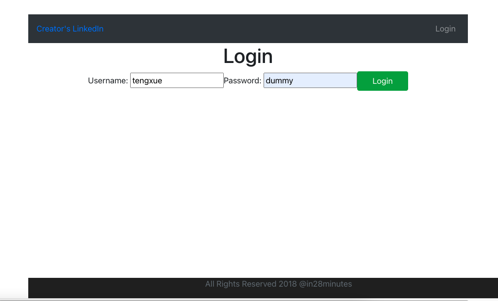
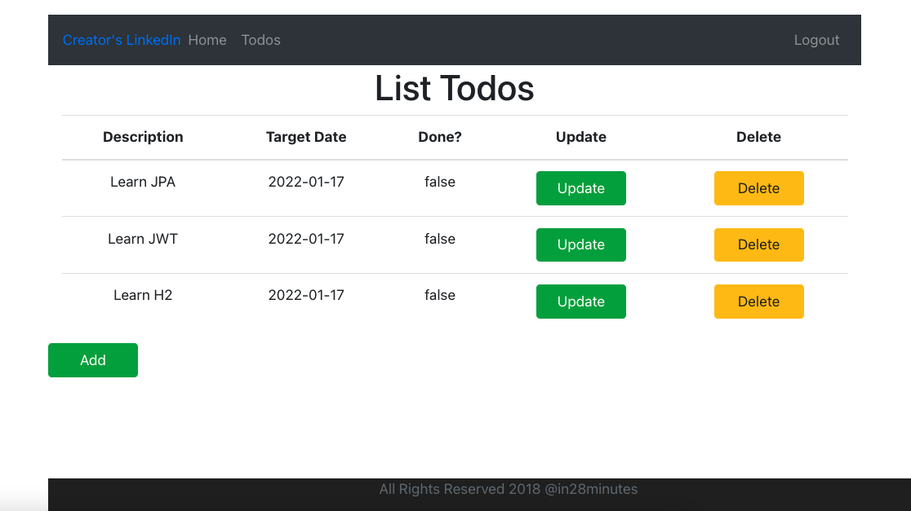

# Basic Todo Management Application

Developed a FULL STACK Application using **React** (Frontend View Framework), **React Create App** (To create React project), **Spring Boot** (REST API Framework), **Spring** (Dependency Management), **Spring Security** (Basic Authentication and Authorization), **In Memory Database H2**, **BootStrap** (Styling Pages), **Maven** (dependencies management), **Node** (npm).

* Developed a Todo Management Full Stack Application step by step - in more than 100 steps - with login and logout functionalities.
* Built awesome frontend applications with React using the basic of React - React Components (JSX, State, Props) and Routing.
* Built secured backend RESTful APIs with Spring Boot using Spring Security to configure Basic Authentication. 
* Used a wide variety of Spring Boot Starter Projects - Spring Boot Web, and Spring Boot Data JPA.
* Connected an React Frontend to a RESTful API.
* Connected REST API to JPA/Hibernate with Spring Boot and H2 In Memory Database.

